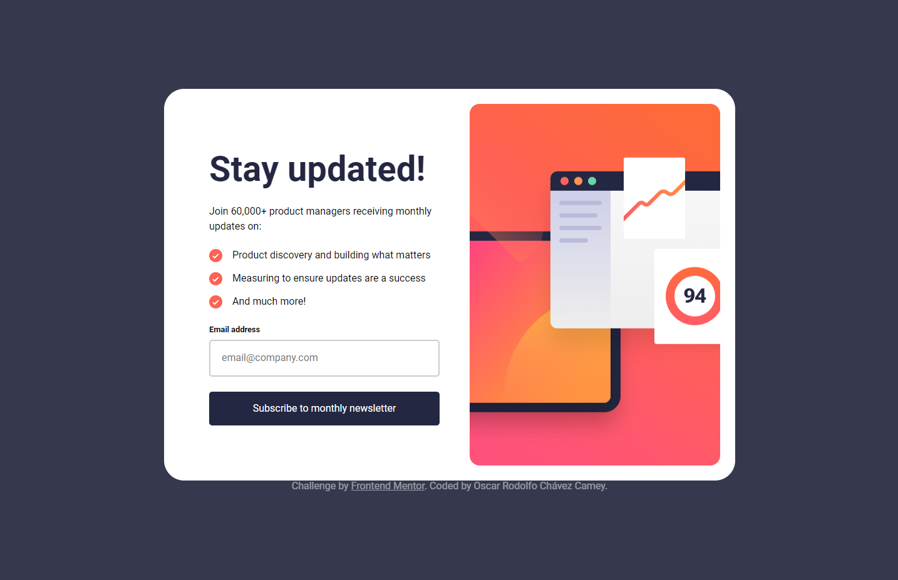
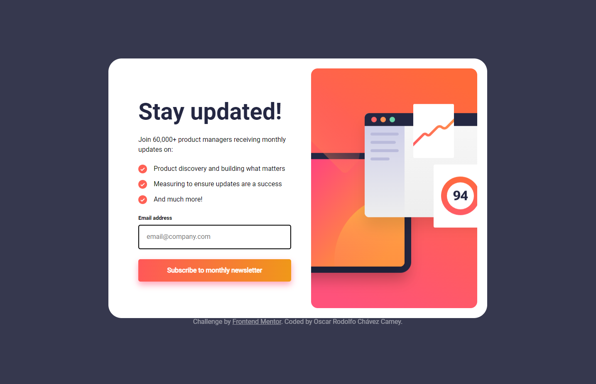
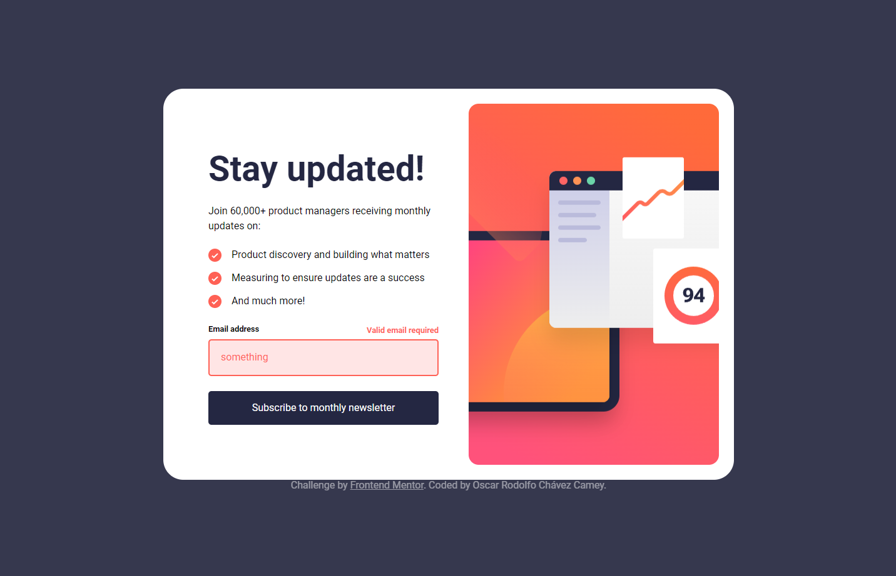
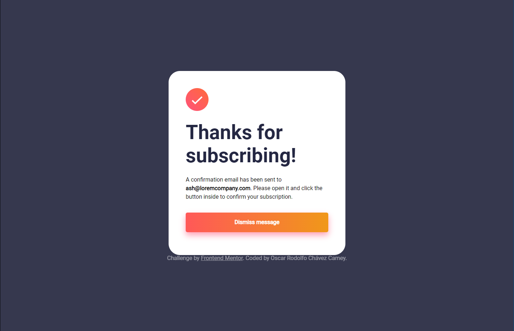
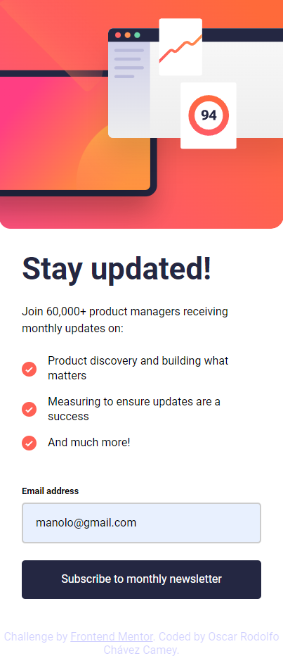
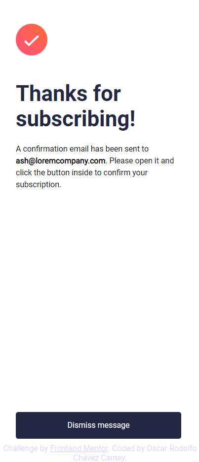

# Frontend Mentor - Newsletter sign-up form with success message solution

This is a solution to the [Newsletter sign-up form with success message challenge on Frontend Mentor](https://www.frontendmentor.io/challenges/newsletter-signup-form-with-success-message-3FC1AZbNrv). Frontend Mentor challenges help you improve your coding skills by building realistic projects. 

## Table of contents

- [Overview](#overview)
  - [The challenge](#the-challenge)
  - [Screenshot](#screenshot)
  - [Links](#links)
- [My process](#my-process)
  - [Built with](#built-with)
  - [Useful resources](#useful-resources)
- [Author](#author)

## Overview

### The challenge

Users should be able to:

- Add their email and submit the form
- See a success message with their email after successfully submitting the form
- See form validation messages if:
  - The field is left empty
  - The email address is not formatted correctly
- View the optimal layout for the interface depending on their device's screen size
- See hover and focus states for all interactive elements on the page

### Screenshots

#Desktop

#Desktop-Active

#Desktop-Error

#Desktop-2

#Mobile

#Mobile-2

### Links

- Solution URL: [Frontend Mentor]()
- Live Site URL: [GitHub Pages](https://oscarrodolfoumg.github.io/Challenge-Newsletter-sign-up-form-with-success-message/)

## My process

### Built with

- Semantic HTML5 markup
- SASS custom properties
- Flex
- Javascript

### Useful resources

- [Flex](https://medium.com/@MakeComputerScienceGreatAgain/understanding-flexbox-a-comprehensive-guide-992bcd5f04de) - This is an amazing article which helped me understand Flexbox

- [SASS](https://sass-lang.com/guide/)

- [SASS Cheatsheet](hhttps://dev.to/finallynero/scss-cheatsheet-7g6)

## Author

- Frontend Mentor - [@OscarRodolfoUMG](https://www.frontendmentor.io/profile/OscarRodolfoUMG)